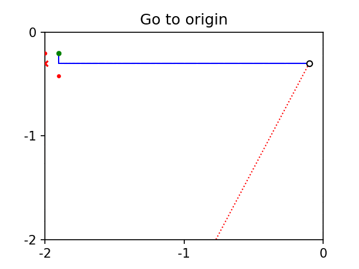
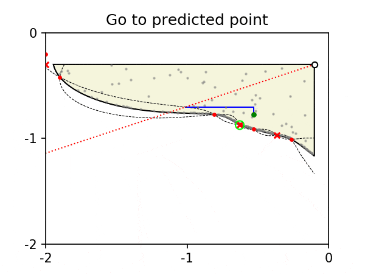

# Algorithm overview
This file explains an animation of the algorithm so that it is easier to understand all its components. A '.mp4' animation containing 15 iterations of the algorithm (as detailed in our [paper](https://arxiv.org/abs/2001.02589)) in a 2D space can be found [here](movie.mp4). Below we explain in detail specific iterations.

## Initialisation
When the algorithm is first started, for the first few iterations it performs initialisation. In the provided animation initialisation lasts 3 iterations and in the paper initialisation stage lasted 30 iterations.

For the first few iteration candidate unit vectors to investigate are selected uniformly in angle. The pinch off is then found by first moving to the origin. After moving to the origin, the algorithm starts searching along the direction corresponding to the selected unit vector. This search ends if the current falls below a specific threshold or if the bounding box is hit (in this case -2V). When the pinch off is detected a local search for coulomb peaks is performed. After this is performed the algorithm starts pruning this is done by moving back a small amount (+100mV in this example) and searching parallel to the gate axes. During this procedure information about whether these searches find pinch off's or if they just hit the bounding box are logged.
### Iteration 1
In the below example a candidate unit vector is selected, and the algorithm performs a search along the direction from the origin. The search ends when the bounding box is hit (i.e. no pinch off is observed). A coulomb peak check is performed, and no coulomb peaks are observed. The algorithm then performs pruning by first stepping back and then performing two searches parallel to the two axes of the voltage space. The first of these traces finds a pinch off, however the second of these traces does not.

### Iteration 2
At the beginning of this iteration the origin is updated. Another candidate unit vector is selected, and the algorithm performs a search along the direction from the updated origin. The search ends when a pinch off is identified. A coulomb peak check is performed, and no coulomb peaks are observed. The algorithm then performs pruning by first stepping back and then performing two searches parallel to the two axes of the voltage space. Both of these traces find a pinch off.

## Main sampling
When the initialisation is over the algorithm moves to main sampling this lasts for the remaining amount of iterations which is 12 in this case (in the paper it was typically 470). 

A gaussian process regression model (hypersurface model) is used to predict the distance from the origin to the pinch off (or bounding box) given a candidate unit vector. This model effectively aims to model the pinch off hypersurface. Given this hypersurface model a candidate unit vector is selected by simulating particles undergoing Brownian motion within the predicted surface. Whenever one of these particles attempts to cross the surface the point where it crosses is added to a list of potential candidates.

A gaussian process classification model is used to predict the probability of observing a coulomb peak given a candidate point in voltage space. Given this model of where coulomb peaks are a candidate point to observe is selected by sampling the list of potential candidates proportionally to the predicted probability of each candidate exhibiting coulomb peaks (Thompson sampling). If all potential candidates are predicted to be equally likely to exhibit coulomb peaks (as they are before the model has obtained enough training data) then all potential candidates are equally likely to be selected as the next direction to make an observation in.

After using the two models specified above to select a candidate point the direction from the origin to this point is converted to a unit vector and the algorithm starts searching along this direction. To avoid having to return to the origin every iteration the algorithm uses the model of the pinch off hypersurface to predict where the pinch off is expected to be the search is then continued as if the algorithm had returned to the origin. This search ends if the current falls below a specific threshold or if the bounding box is hit (in this case -2V). If the starting point is outside of the real pinch off hyper surface the algorithm performs a search towards the origin When the pinch off is detected a local search for coulomb peaks is performed. When the pinch off is detected a local search for coulomb peaks is performed.

### Iteration 4
The hypersurface model and gaussian process classification model are used to draw a candidate unit vector. The algorithm uses the hypersurface models predicted pinch off location and standard deviation to select a point to start the search for the pinch off. The selected point happens to be outside of the true pinch off hypersurface so the algorithm searches towards the origin for the pinch off. Once it is found it is verified by quickly searching outwards (this is performed to quickly to see in the animation). A coulomb peak check is performed, and coulomb peaks are observed (as indicated by the green circle).

### Iteration 12
As both the pinch off hypersurface model and gaussian process classification model have accumulated data they make better predictions about the voltage space. You can see this reflected in how observations of the true pinch off hypersurface are denser in locations containing coulomb peaks and how the initial starting location of the pinch off search is very close to the observed pinch off. 

